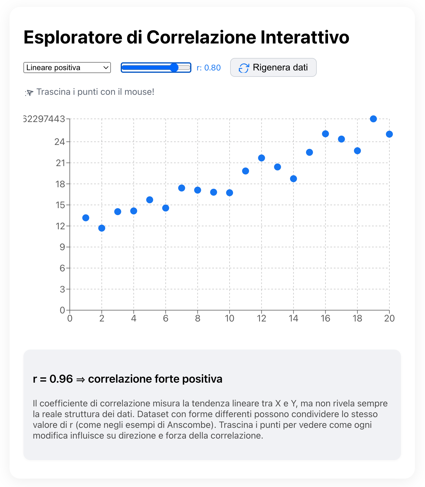

# correlation-explorer

Questa demo interattiva mostra graficamente il concetto di Correlazione per aiutare a comprendere intuitivamente come i dati si correlano secondo alcuni modelli.
E' stata inizialmente creata con ChatGPT O3 per girare in locale, poi avendo dei problemi con alcune librerie è stata data in pasto a Cursor.ai che l'ha trasformata in APP React da poter poi testare in locale
e quindi qui su Github. 

Il processo di correzione è stato completato su Cursor e infine inserito nella Repository GitHub

La grafica interattiva è questa come esempio di screenshot.

